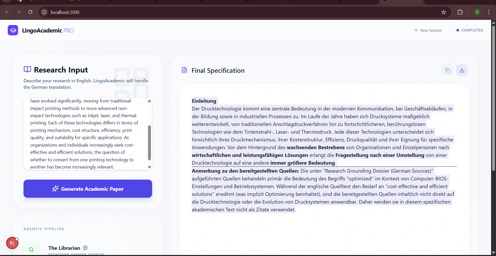

# Marshal Mutisi | Personal Portfolio

A premium, modern, and fully responsive personal portfolio website designed to showcase my journey as an AI Automation Developer and Full Stack Developer.



## 🚀 Features

- **Premium Aesthetics**: Sleek dark mode design with glassmorphism effects and modern typography.
- **Dynamic Hero Section**: Interactive introduction with typing animations and floating graphics.
- **Project Showcase**: Visual project cards with real screenshots, hover effects, and links to GitHub/Live Demos.
- **Work Experience**: A dedicated section highlighting my IT Development internship at Landsiedel NLP Training.
- **Functional Contact Form**: Integrated with **EmailJS** for seamless email delivery directly from the site.
- **Cross-Platform Support**: Fully responsive design optimized for mobile, tablet, and desktop.
- **Fast Performance**: Built with **Vite** and **React** for near-instant load times.

## 🛠️ Tech Stack

- **Frontend**: React.js, Vite
- **Styling**: Tailwind CSS, CSS3
- **Animations**: Framer Motion, Lucide-React
- **Tools**: EmailJS, Git/GitHub

## 📦 Installation & Setup

1. **Clone the repository**:
   ```bash
   git clone https://github.com/MarshalMutisi/Marshal-Mutisi-portofolio.git
   cd Marshal-Mutisi-portofolio
   ```

2. **Install dependencies**:
   ```bash
   npm install
   ```

3. **Set up Environment Variables**:
   Create a `.env` file in the root directory and add your EmailJS credentials:
   ```env
   VITE_APP_EMAILJS_SERVICE_ID=your_service_id
   VITE_APP_EMAILJS_TEMPLATE_ID=your_template_id
   VITE_APP_EMAILJS_PUBLIC_KEY=your_public_key
   ```

4. **Start the development server**:
   ```bash
   npm run dev
   ```

5. **Build for production**:
   ```bash
   npm run build
   ```

## 📬 Contact

Let's build something amazing together!

- **Email**: [mutisimarshal@gmail.com](mailto:mutisimarshal@gmail.com)
- **LinkedIn**: [marshal-mutisi](https://linkedin.com/in/marshal-mutisi-34a07a298)
- **GitHub**: [@MarshalMutisi](https://github.com/MarshalMutisi)

---
*Created with ❤️ by Marshal Mutisi*
